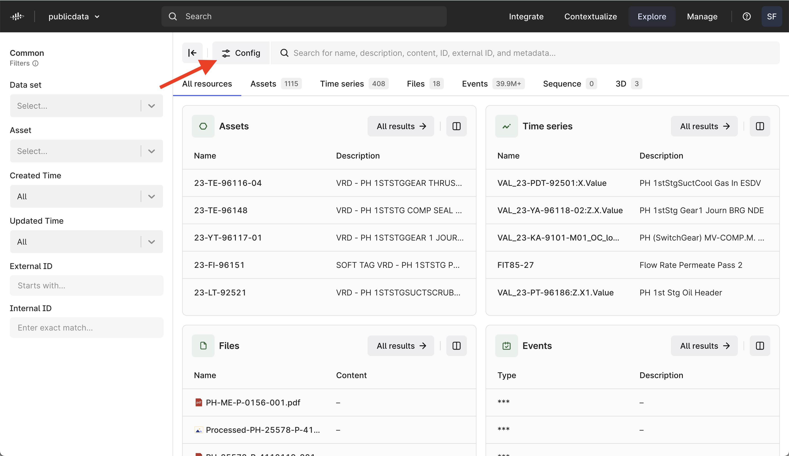
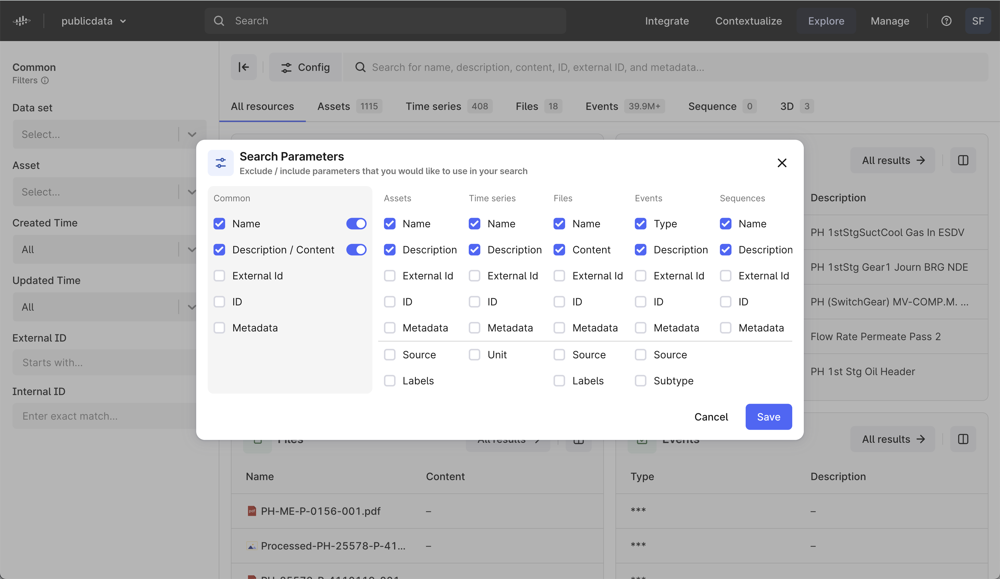
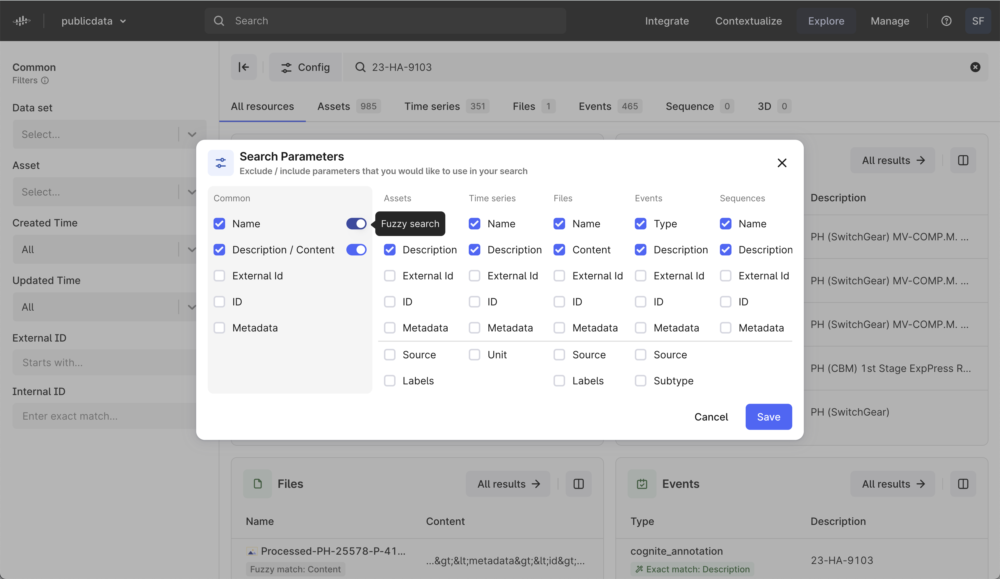
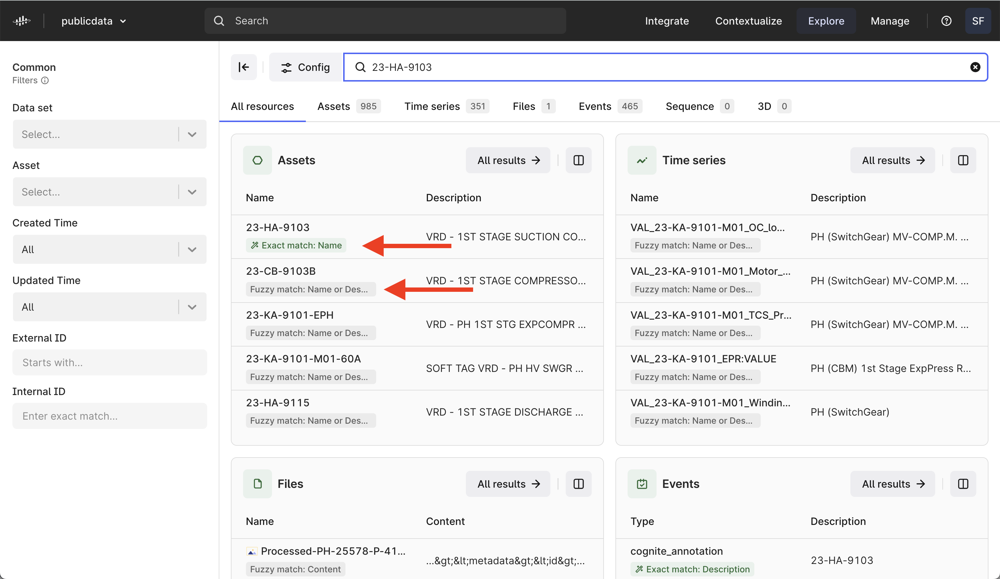
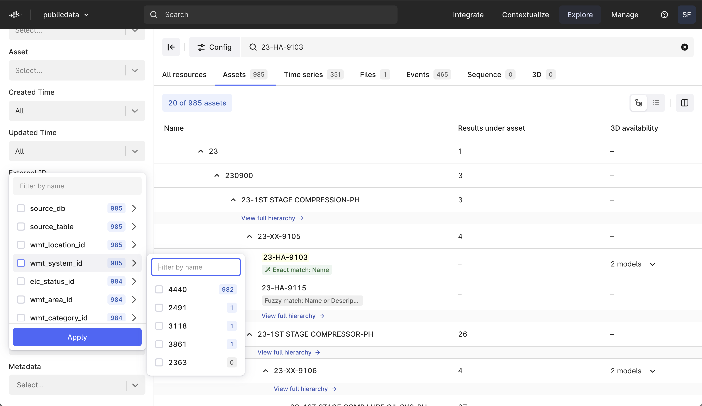
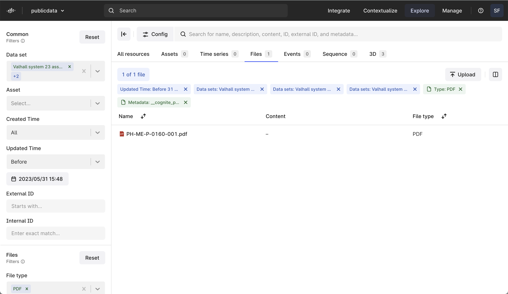
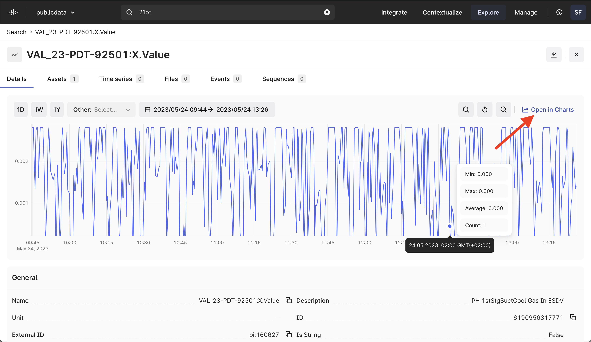
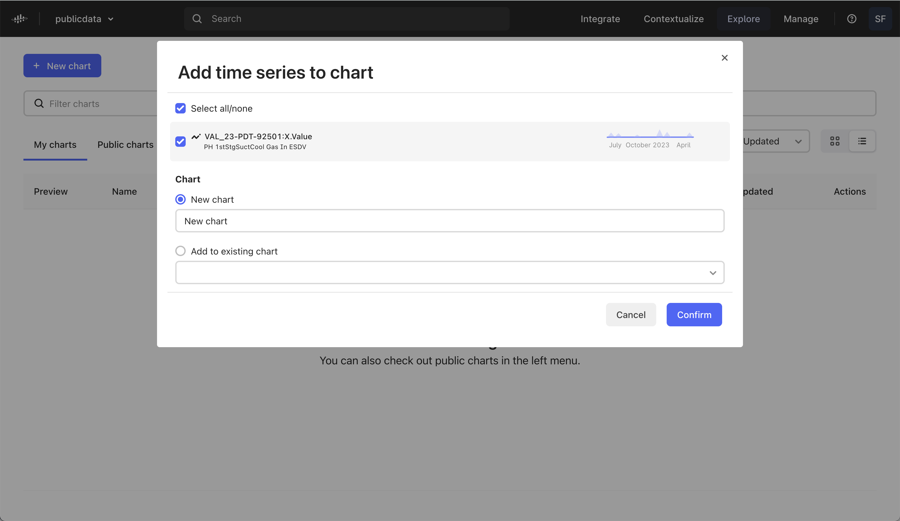

# Explore data with Cognite Data Fusion

My latest notes update for this training was done on November 10, 2023. For the latest information updates, you can go directly to the official training resources in Cognite Academy. However, here you will find all my tips and deeper explanations.

## The cognite use case example

Everything starts with a trigger, like an external request from a fellow on-site engineer to troubleshoot some equipment, or something more internal, like an idea you might get for optimizing the production or maintenance process. 

From there, you must first find, explore, and visualize relevant data from various systems. By doing so, you can then perform a contextual analysis to gain a systems understanding of the issue and the challenge you will potentially address. 

The next lesson demonstrates how domain experts can begin troubleshooting using Data Explorer in Cognite Data Fusion.

## Data Explorer 

Through Data Explorer in Cognite Data Fusion, availabe at [Cognite](fusion.cognite.com),you can now search for all your CDF data, and configure the search parameters.

To narrow down your search results, toggle the different parameters on or off.

Toggle fuzzy search to help you get results in cases where you're not entirely sure of what to look for or the correct spelling.

Each result includes a label that indicates how it matches with your search.

You can now filter on metadata and search on all the metadata keys and values available in your CDF project.

Relevant filters are kept as you explore, with multiple filter value selections, and the applied filter visible at the top of the results view. Filter options will also adapt to the selected data, showing only relevant filters.

Time series charting has an improved user experience, with the option to open in Cognite Charts.

Add your time series to a new or existing chart, in Cognite Charts.

## Hands-on instructions

If you went through the previous course in this learning path, you should be able to sign in to Cognite Data Fusion. If you need a reminder, here's how:

1.  Go to fusion.cognite.com
2.  Enter publicdata as your organization name
3.  Sign in with Microsoft
4.  Select the project publicdata

You can now try to replicate the steps taken in the video. The steps from the demonstration are listed below: 

* Open Data explorer
* Search for “cooler”
* Click "Assets"
* Click 23-HA-9103 (VRD - 1ST STAGE SUCTION COOLER)
* Click Time series in the preview window
* Open VAL_23-PDT-92501:X.Value
 

* Go back to your search
* Click Files (in the equipment preview window)
* Open the PDF “PH-ME-P-0003-001.pdf”
* Click “0004-001” (red annotation to the right of the doc)
* Click View file and/or “Open side-by-side”
 

Go back to main search view
View asset 23-HA-9103 again (make sure the filter for 3D availability is turned on)

* Under the column 3D availability, open Vallhall PH colored (2020-09-10 13:43 revision).
* Navigate around the 3D model (try using wasd and arrow keys to fly around :) )
* Highlight other clickable equipment/objects
* Add slicing planes to filter away geometry above the area you are interested in
* Add a couple of measurements (left toolbar)
* Try Fit to model and Fit to asset (left toolbar)