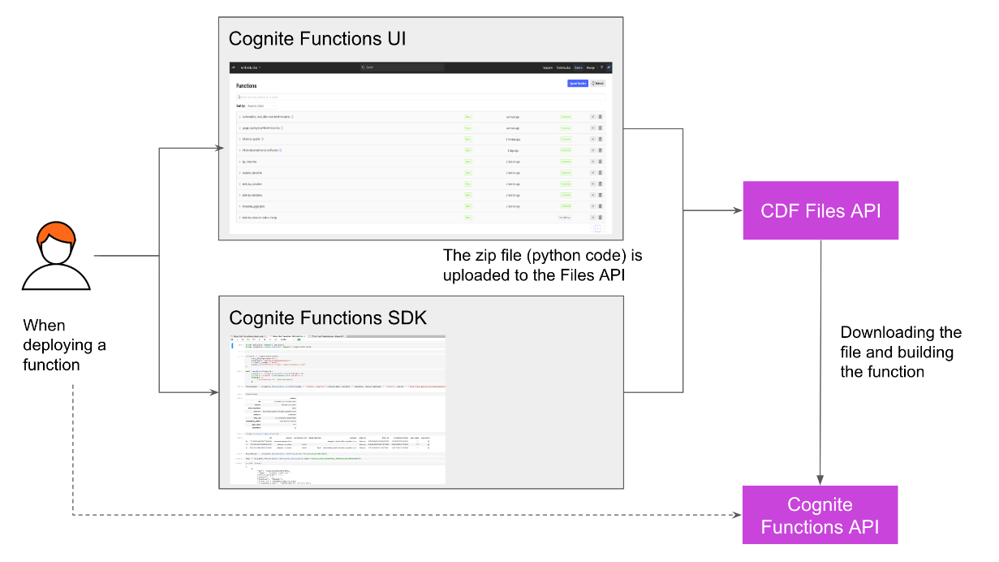
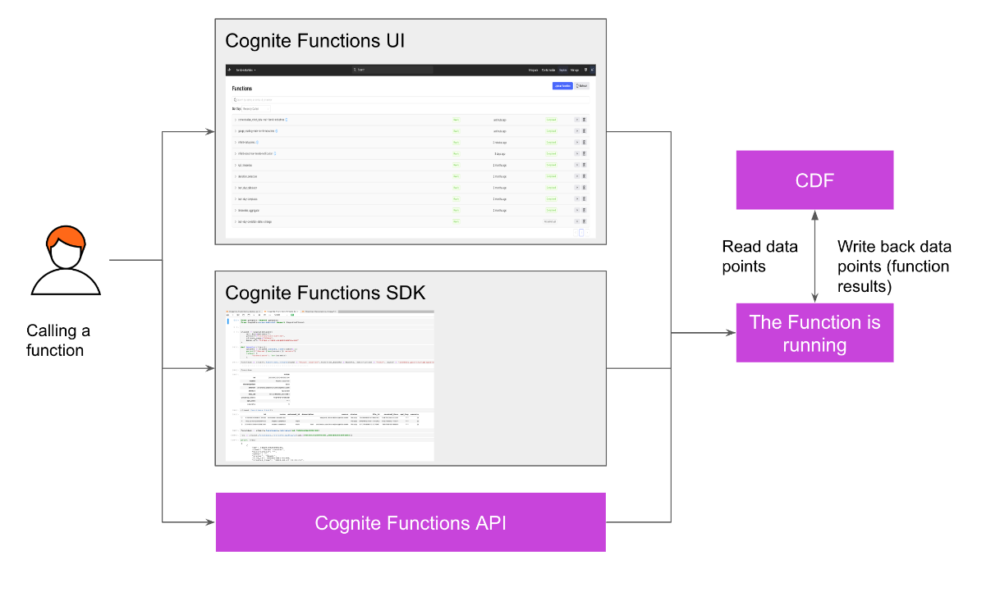

# Cognite Functions

It schedules pyhton functions enabling you to execute your calculations 

Before you start the course, complete the prerequisites:

- Complete the Cognite Data Fusion Fundamentals learning path.
- Complete the Learn to Use the Cognite Python SDK course. 
- Have Python, Git, and a Python IDE of your choice (we really like Jupyter notebooks) installed on your computer.
- Install cognite-sdk (v.4), pandas, and msal packages using either pip or poetry. Note: this course uses SDK version 4.
- Have a GitHub account. (This isn't mandatory. You can clone the course repository without a GitHub account as well but only via the HTTPS method. For this, you'll receive instructions.)

During the course, watch the demonstrations and run the code. Then, prove your knowledge in the test.

- Clone the repository dedicated to this course when instructed in the course.
- Follow along with the videos and run the code in the provided notebooks in your cloned repository.
- It can be useful to have two screens: one to watch the demonstrations and another to run the code.
- You will sometimes write data to CDF. Please note that you have write access to a particular data set to avoid accidentally overwriting the source data. You will notice this in the code when a data set is assigned to a CDF resource type that you'll create.
- If you need help, search the Cognite community, Cognite Hub, or connect with instructors and peers in the Academy Discussions. - - When you need help with the course exercises, please mention the course and lesson name so we can assist you with your query at the earliest.

After the course:

- Continue to use the SDK documentation, the Cognite Functions documentation, and the provided notebooks as a reference when you work with the Cognite Python SDK.
- You can use the CI/CD pipeline with Github actions (as you'll see in Notebook 5) to deploy Cognite Functions.

To access the cognite fusion for follow the examples please enter the organization name as cognite-learn then select ds-cognitefunctions as the project name. 

## Typical workflow

Let’s see what a typical workflow looks like with Cognite Functions.

- You create your code for the calculation.
- You restructure this code so that it is in the format that is expected by Cognite Functions (handler.py).
- When you have created this handler.py, you can create and deploy the function using Python SDK or the CDF user interface.
- When the function is deployed and ready, it can be called on-demand or on a schedule. You can monitor the status of deployment and function calls in the Fusion user interface as well as using code.
-Should I use the SDK or the CDF user interface?

- Choose the CDF user interface when you deploy a single function for experimental or test purposes, and use the SDK when you want to deploy functions that are automatable, scalable, and reusable.

- We suggest using the user interface to manage and get an overview of all your functions.

- What does the architecture of Cognite Functions look like?

1. When deploying a function via Python SDK or the CDF user interface.

2. When calling a function via Python SDK or the CDF user interface.

