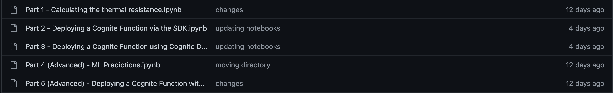
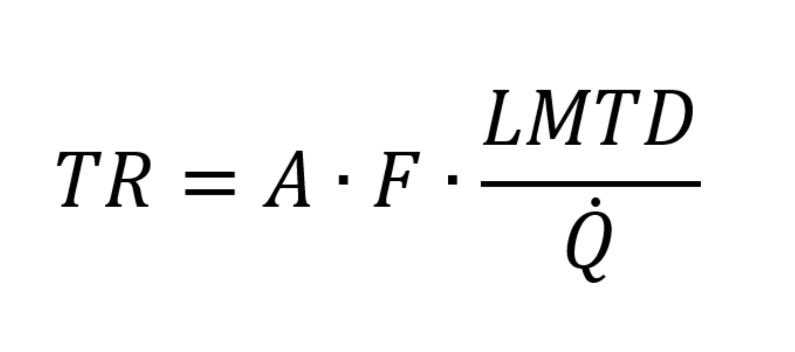
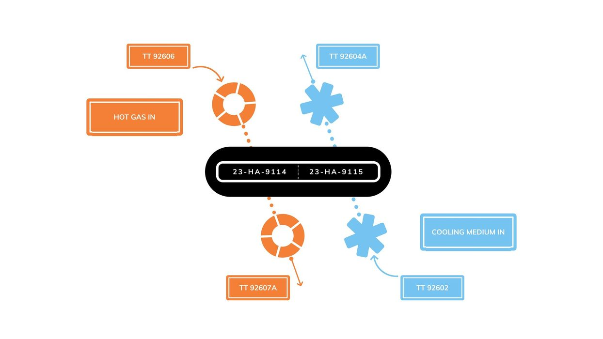
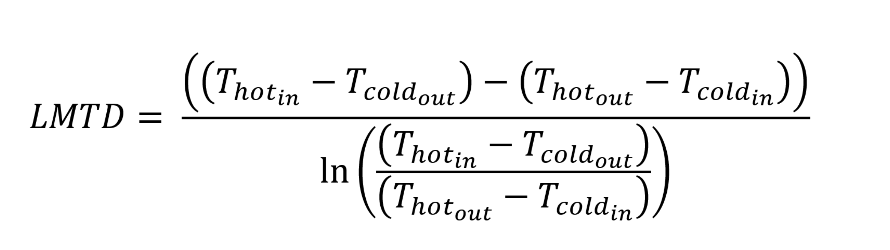
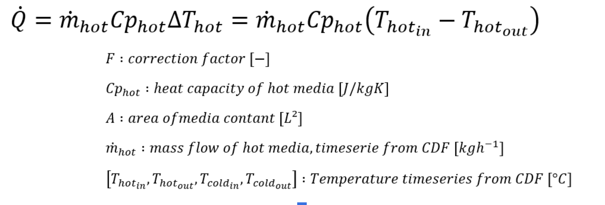

We are going to solve this use case in five parts. Each part is performed in a separate notebook.

1.  Retrieving data from CDF with the SDK and calculating the thermal resistance of a heat exchanger.
2.  Implementing this calculation as a Cognite Function that runs on a schedule using the Python SDK.
3.  Implementing this calculation as a Cognite 
Function using only the CDF UI.
4.  (Advanced) Forecasting the thermal resistance using a machine learning algorithm.
5.  (Advanced) Learning how to use GitHub Actions to deploy a Cognite Function in GitHub automatically.
screenshot of github repository with a list of 5 notebooks

Parts 4 and 5 are optional. We recommend these exercises to learners with insatiable curiosity. They will take a little more reading, searching, and trial and error.

We encourage you to go through the notebooks and run the code yourself. To do that, clone the repository dedicated to this course. Please note that the video demonstrations may slightly differ from the notebook examples. This is because we make necessary updates on the course repository due to continuous improvements in our products.

Happy coding!

## Notebook 1: Retrieving data and calculating thermal resistance

The first notebook covers step one of the typical workflow with Cognite Functions: creating the code for the calculation. 

In this notebook, we will retrieve heat exchanger data from CDF using the Python SDK and use it to calculate the thermal resistance.

In the following two lessons, you will:

* Learn how to calculate thermal resistance.
* Watch a demo of running the code in notebook 1.

### Thermal resistance

The formula for calculating the thermal resistance is:

A: Area [L2]
F: Correction factor [-]
LMTD: Log Mean Temperature Difference
Q: Heat Transfer Rate

The area and the correction factors are defined as constants based on the information given in the heat exchanger specifications. 

The log mean temperature difference and heat transfer rate from this formula need to be calculated using time series data and the constant Cp_hot. The time series needed are all available in CDF. This diagram shows the specific ones we'll be working with. For simplicity, the diagram shows both heat exchangers as one. 

 

 