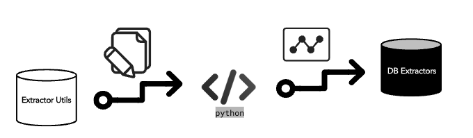
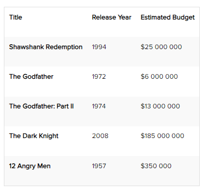

## Introduction to Cognite Pyhton Extractor Utils Packgage

### Benefits

What is the Cognite Extractor-utils Python package?

The Cognite Extractor-utils is an extension of the Cognite Python SDK, and makes it easier to develop custom data extractors for CDF.



Extractor-utils has been developed in Cognite and is currently used in the DB extractor.

It is commonly used in many of the extractors due to less complexity.


This library will help you create a Pyhton based extractor. It runs on top of the Cognite Pyhton SDK to have more consistent config files, make sure to reuse code and avoid reimplementing the same features across extractors. For example, if you use this library, the config files will have the same format idenpendent of the extractor type. The goal is to develop quality extractor faster and make new features available immediately. This way, if you need support for new authentication, you don't need to change your extractor - you just update the library.

### The Advantages

The main advantages of the Extractor-utils library: 

* To avoid reimplementing the same features across extractors.
* Easier and more consistent configuration files.
* To develop quality extractors fast.
* New features are available immediately across all extractors.


## Step by Step

###  Step 1 - Starting a new extractor project:

The easiest way to set up a new extractor project is to use cogex. To install it, run ``` pip install cognite-extractor-manager ``` in a shell. To initialize a new extractor project, run cogex init in the directory you want your extractor project in.

Running ``` cogex init ``` will first prompt you for some information about your extractor, and then set up a poetry environment, git repository, commit hooks with type and style checks and load a template.

### Step 2 - Import the new extractor project into PyCharm:

PyCharm is a tool for developing python projects, and the community edition is free. To import the project, you need to select a new project, make sure that pure python is selected and choose the correct directory for location.
For the interpreter, click the select button and move to the directory of your project, open the .venv folder, go to the bin. In there, you will find the python binary. It will ensure that PyCharm uses the same virtual environment as poetry, which means all dependencies will be included.
Click create to create a project from existing sources. Now, you see the project successfully imported into PyCharm.

### Step 3 - Defining a config schema:

You will start off by defining how you want the users to configure the extractor. cogex has already created a config.py file with a config class based on the BaseConfig class from extractor-utils. You need to extend this with a list of files the extractor should read from.

Config schemas are defined using data classes and type hints. For each file, you want to read you, need to know

The path to the file. You can use str for this.
Which column in the CSV file to use as the key in RAW. You can use str for this too.
Which RAW database and table to write to. For this, you will use the pre-built RawDestinationConfig from cognite.extractorutils.config tools.

Code snippet from demo video

Code A - config.py:
```
from dataclasses import dataclass
from typing import List
from cognite.extractorutils.configtools import BaseConfig, RawDestinationConfig, StateStoreConfig

@dataclass

class ExtractorConfig:
    state_store: StateStoreConfig = StateStoreConfig()

@dataclass

class FileConfig:
    path: str
    key_column: str
    destination: RawDestinationConfig

@dataclass

class Config(BaseConfig):
    files: List[FileConfig]
    extractor: ExtractorConfig = ExtractorConfig()

```
Code B - example_config.yaml:
```

logger:

    console:
        level: INFO

 cognite:

    # Read these from environment variables
    host: ${COGNITE_BASE_URL}
    project: ${COGNITE_PROJECT}

    idp-authentication:
        token-url: ${COGNITE_TOKEN_URL}
        client-id: ${COGNITE_CLIENT_ID}
        secret: ${COGNITE_CLIENT_SECRET}
        scopes:
            - ${COGNITE_BASE_URL}/.default
files:

    - path: example.csv
      key-column: Title
      destination:
          database: my-db
          table: my-table
```


## Step 4 - Read CSV files:

In this chapter, you will see how you can read and parse CSV files with Python. The standard library in Python actually has a CSV module that makes this process very easy.

In the extractor.py file generated by cogex starts by defining a logger object.

Then define a new extract_file function that will take in a FileConfig and an upload queue. Look more closely at upload queues in the Uploading data to CDF chapter. Any project initiated by cogex will perform type checks before every commit.

To make the extractor observable and easier to debug if something should go wrong, it is good to have the extractor make small log statements whenever it does something worth noting.

Create a new DictReader, imported from the CSV module. If you want the extractor to be even more generic, you could have made the delimiter configurable as well.

You now have a reader object. This is an iterator that will return each row in the CSV file as a dictionary where column names are keys and the row are values. You can now iterate over this reader and add all the rows to the upload queue using the add_to_upload_queue method.

Code snippet from demo video
Code - config.py:

 ```

def extract_file(file: FileConfig, queue: RawUploadQueue) -> None:

    with open(file.path) as infile:
        reader = DictReader(infile) 
        for row in reader:
            queue.add_to_upload_queue(
                database=file.destination.database,
                table=file.destination.table,
                raw_row=Row(key=row[file.key_column], columns=row),
            )
```

example.csv:




## References

* [Cognite Extractor Utils Documentarion](https://cognite-extractor-utils.readthedocs-hosted.com/en/latest/quickstart.html)
* [Cognite Python SDK Documentation](https://cognite-sdk-python.readthedocs-hosted.com/en/latest/)
