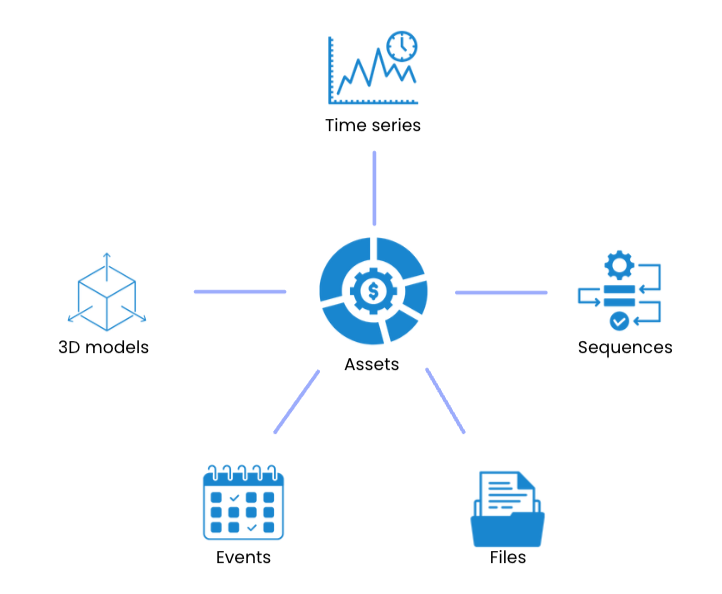
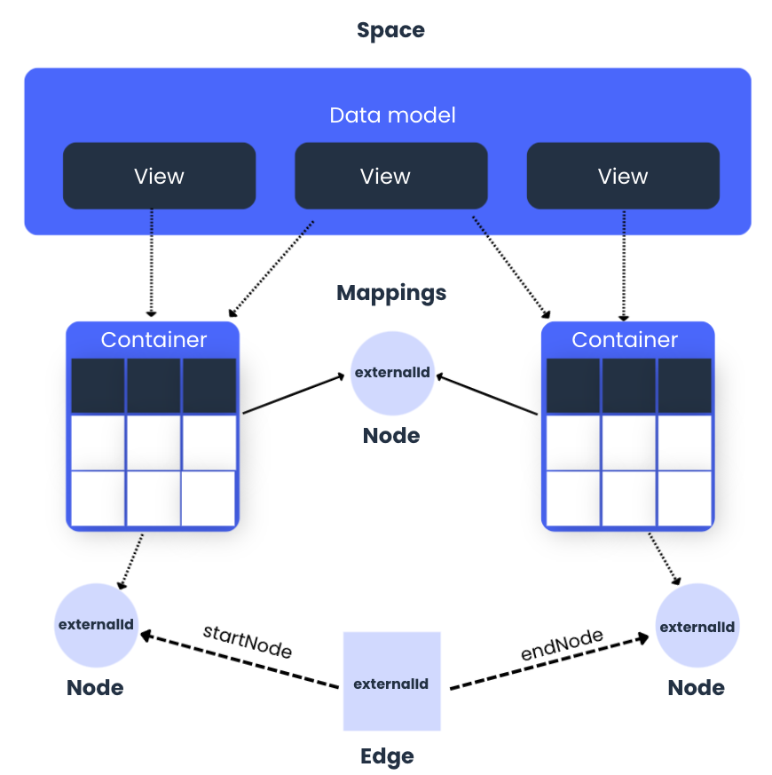
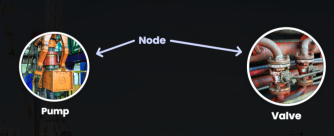
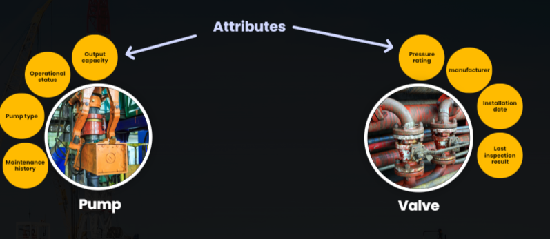
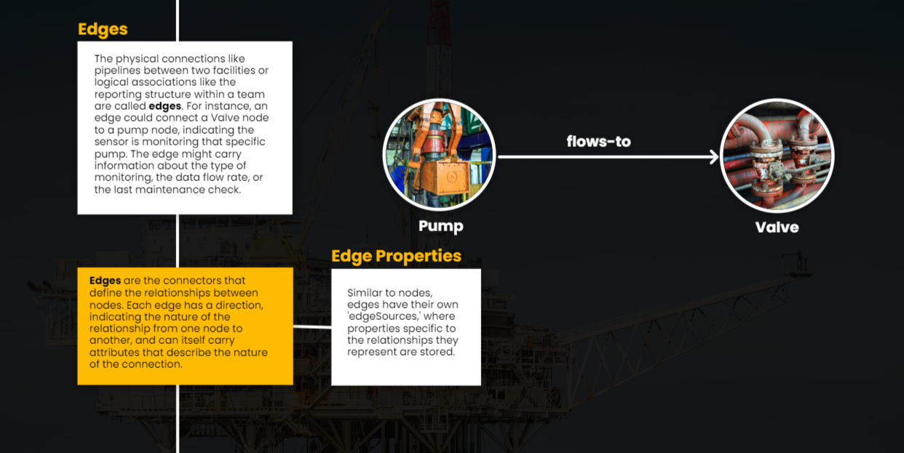
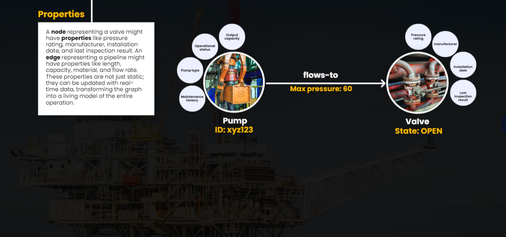
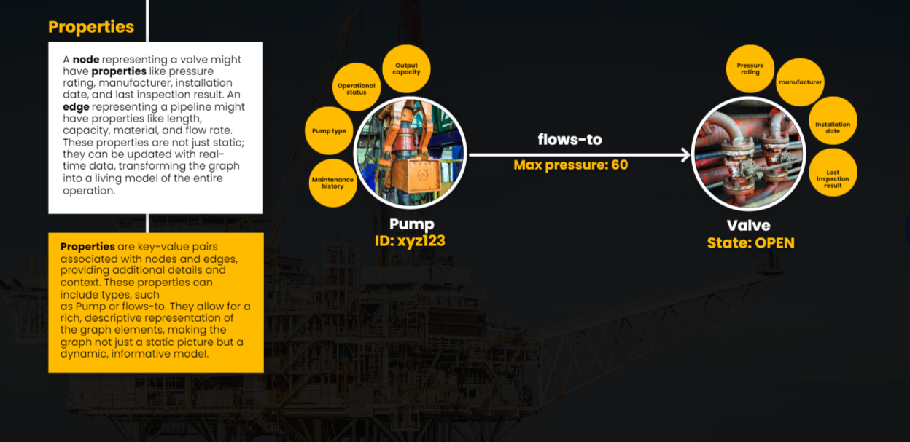
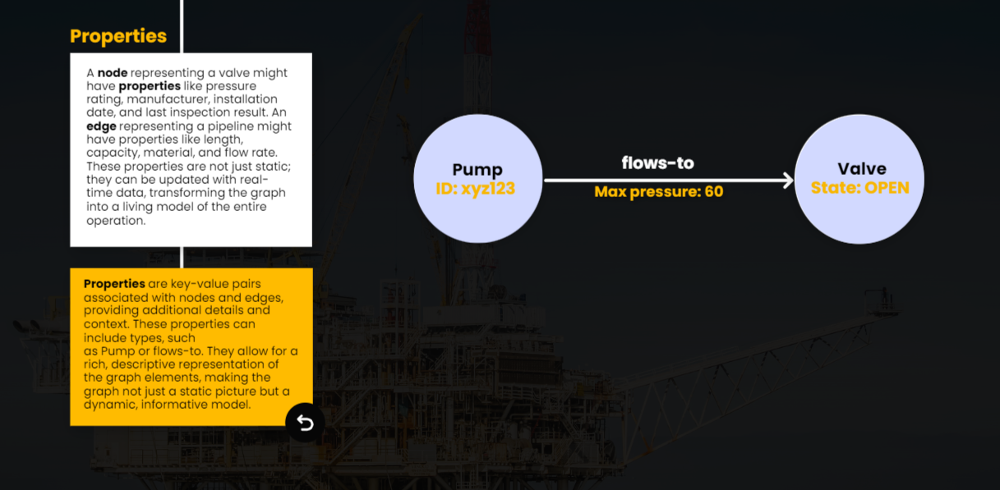

What is Cognite Data Modeling?

The data modeling process acknowledges that business data is a vital asset for the organization, which needs to be thoroughly understood and carefully managed. 

Data modeling in Cognite Data Fusion allows organizations to build expressive and scalable data models to represent their industrial reality to unlock the value of data across their source system.

* Assets
Assets are digital representations of objects from the physical world. They are typically recognized by humans (for example, a pump, a production system, etc.) Assets connect related data from different sources and are key to identifying all the relevant data of an object. All other resource types, including time series, events, and files, should be connected to at least one asset, and each asset can connect to many resources and resource types.

* Sequences
Sequences are a resource type. They store series of rows indexed by row number. Each row contains one or more columns with either string or numeric data. Examples of sequences are performance curves and various types of logs such as depth logs in drilling. An asset can have one or more sequences connected to it.

* Files
Files are a resource type. They store documents that contain information related to one or more assets. Example: A file can contain a piping and instrumentation diagram (P&ID) that shows how multiple assets are connected.

* Events
Events is a resource type. It stores information that happens over a period of time. Events have a start time and an end time and can be related to multiple assets. For example, an event can describe two hours of maintenance on a water pump and associated pipes or a future time period when the pump is scheduled for inspection.

* 3D Models
3D models are a resource type. They provide visual and geometrical data and context to assets. For example, we connect a pump asset with a 3D model of the plant floor where it is located. Seeing asset data in 3D is a great way to discover and find the data you are interested in.

A data model organizes data objects and standardizes the properties of real-world entities and how they relate to one another. Data models are the core of an ontology, a knowledge graph, or an industry standard and are crucial in building solutions like data science models, mobile apps, and web apps.

# Uses of Cognite Data Modeling Services

Data is vast and can be challenging to sift through unless you have a model that helps you make sense of the connections between each data object. 

Cognite Data Modeling Services accelerates the work of developers, business analysts, data architects and decision makers because it allows them to easily access relevant information for each of their roles. 

Cognite Data Modeling Services serve various purposes to enhance how information is managed and utilised. 

Click the button below to learn more about these uses.

## Build Expressive and scalable Data Models

Cognite Data Modeling Services encapsulates five fundamental concepts: spaces, instances, containers, views, and data models. These elements serve as the building blocks for constructing and navigating complex industrial knowledge graphs

* Space: Think of these as distinct areas or 'rooms' where specific data or models live.
* Data Model: The blueprint or structure defining how data is organized and related.
* View: Custom perspectives or ways to see and interact with the data.
* Container: The space holds containers. Containers are groups of properties.
* Node: The fundamental elements representing objects (like pumps in an oil field).
* Edge: The lines connecting Nodes, showing relationships (like pipelines between pumps).
* externalId: A unique identifier for the instance within its space. This is crucial for referencing and managing instances individually.
* startNode, endNode: (For edges) specifies the start nodes that the edge connects, indicating the direction and nature of the relationship.

Example:

### Nodes

Each piece of equipment (pumps, valves, turbines), each resource (oil reserve, gas packet) and even each personnel member can be represented as a *node* wihin a property graph

For instance, a pump at a drilling site would be a node, encapsulating attributes like it type, operational status, maintenance history, and output capacity. Similary, each valve is also a node.

Nodes are the primary entities wihing a property graph, representing discret objects or concepts. In a graph modeling context, each node is a unique data point with its on set of attributes.

Node properties: Nodes can link to properties stored in one or more views/containers. Think of these as external 'shelves' where node-related information is kept.

### Edges

### Properties

1
What is Data Modeling?
Simplifies viewing and understanding data relationships. Think of it like creating a blueprint for a building, but in this case, it's for data.

Core Purpose: Organises and standardizes how we see real-world entities in a system and their interactions.

2
Cognite Data Modeling Services Usage
Building Models: Create detailed and scalable representations of data.
Ingesting Data: Populate models with real, operational data.
Querying Models: Extract and analyze data within these models.
3
Enhancing Industrial Knowledge with Cognite Data Fusion (CDF) Role
Knowledge Graphs: Built from simple elements (nodes, edges) but represent complex industrial systems.
CDF allows for adaptable solution data models on top of a comprehensive industrial knowledge graph, enabling informed decisions and improvements in industries.
4
Core Concepts of Cognite's Data Modeling Services: Five Pillars
Spaces: Think of these as distinct areas or 'rooms' where specific data or models live.
Instances: Individual occurrences of data or objects within Spaces.
Containers: Groups holding related Instances or Spaces.
Views: Custom perspectives or ways to see and interact with the data.
Data Models: The blueprint or structure defining how data is organized and related.
REST APIs Role: These are the tools to create, update, or delete these concepts, effectively shaping your industrial knowledge graph.
5
Exploring Property Graphs: Basics
Nodes: The fundamental elements representing objects (like pumps in an oil field).
Edges: The lines connecting Nodes, showing relationships (like pipelines between pumps).
Properties: Additional details or attributes of Nodes and Edges, providing more context.
