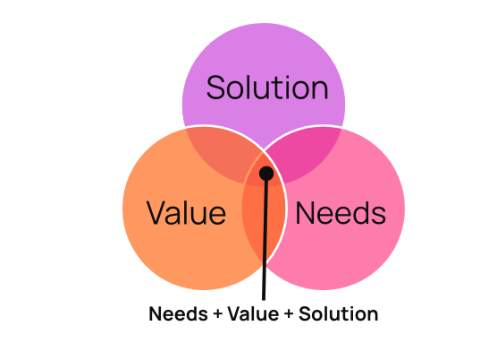

# What business challenges are we solving and who are our target customers?

## Introduction

Our customers (Energy, Chemical Process and Power & Renewables Industrial Companies)  are constantly challenged to achieve their KPIs and previously set goals, while maintaining the trend of constant growth and development. They are pressured to identify new ways to increase their revenue, reduce costs, reduce risks and create safer working conditions. 

Efficient and effective way of working starts with identifying gaps in the current processes, enabled with innovative tools and achieved through transformation and change. Change is influenced by many factors and includes the improvement of processes, upskilling of people, adoption of new technologies, optimisation of existing tools, etc. Our main focus is to enable change and drive business outcomes by providing modern technologies in the form of software solutions that will bring valuable accurate insights, enable high-quality decisions and simplify the existing processes, while reducing costs and time spent on jobs that have to be done. The long term collaboration at the Enterprise level comes from clear impact that represents the intersection of three key segments (see the picture below): 

Needs: Clear business challenges that Cognite can address

Value: Significant or high enough dollar value for the customer

Solution: Enabling tool for addressing the needs is part of the product or the product roadmap

To understand the customer reality we need to identify challenges and business goals at each layer of the customer organization as we will have to ensure Collective Yes to close the Enterprise-Level Deal. Each layer has its own business challenges that they are looking to solve. Let us explore the business challenges at different levels. 