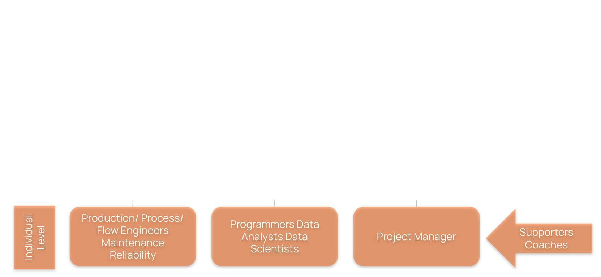
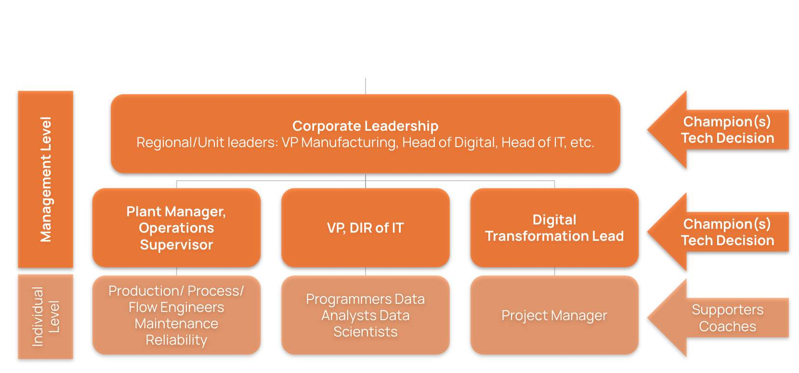
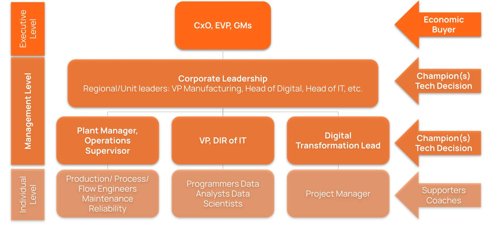

# Organizational Structure at an Enterprise level
When we begin a sales campaign we are constantly asking ourselves who is the right person to have conversations with and at what level to target personas. Different levels within the organization have different needs, different pieces of the problem and power to influence decisions. 

## Individual level

This group represents all individuals that are considered as an End User of Cognite solutions. They are  exposed  on a daily or weekly basis to Cognite Data Fusion through different tasks they have to perform. Examples of these users can include:

* Customer Operational Users: This group includes roles like Production/Process/Flow Engineer, Maintenance, Reliability - they are constantly looking for better ways to gain insights into operations, understand real time interdependency between different systems, to perform their work faster and make better decisions.

* Customer Technical Users: This group includes roles like Programmers, Data Analyst, Data Scientist - they are looking for better ways to build solutions, tools that will help build solutions focused on operational needs and tools that will accelerate the deployment.

* Customer Project Managers: This group includes roles like Project Manager - they are looking for the ways to map out the requirements from operations, understand the impact, feasibility and priority of solutions, build the synergy between technical and operational teams, and accelerate the value creation.

Individual level during the sales process is in most cases considered as a group of coaches that can support the learning process,  impact the deal but have no power to influence the decision of the Economical Buyers. 

Management level

This group represents two areas of management: 1. managers that are responsible for key business KPIs within a plant/facility/production line, and 2. or a corporate or company-wide level related to operations, technical implementation or digital transformation. They are monitoring development, execution and providing guidance to the individual level. 

Examples of managers can include:

Plant Manager, Operations, Supervisor -  They are looking into ways to gain better insights, improve operations, and make better decisions.

VP, Director of IT - They are looking into different ways to deploy solutions that would enable efficiency, keep the costs of ownership low, keep the simplicity of IT architecture, secure while providing easy access to data.

Digital Transformation Manager - they are looking into ways to develop digital strategy that will support operations and IT, close the gap between requirements and capabilities, prioritize initiatives based on the companies’ strategy and support at the individual level.

Examples of Corporate Leadership can include roles like Regional/Unit Leaders: VP Manufacturing, Head of Digital, Head of IT, etc. - they are overseeing and supporting different plants and facilities, looking for ways to improve operations, duplicate successes from a  lighthouse plant/facility to others, and to meet all KPIs on a regional level that will be reported to the Executive Management.

This is the level where we would like to start our outreach, build relationships with customer representatives and identify our champions. Managers and Corporate leadership levels have access to the Economic Buyer and the power to influence decision making. Additionally, the size and impact of challenges at this level are usually significant enough to create a compelling need to purchase solutions. The Management Level is where many Cognite sellers land their first deal with a customer.

Executive level

This group represents all executives, including C-level managers,  that are responsible for the  business objectives and KPIs of the whole corporation. They are monitoring the execution and providing strategic guidance to the middle management level. The Economic Buyer usually sits at this level and has ultimate power to say “Yes” and to move the budget at their discretion according to the needs of the company. In the Land-Expand approach, the Executive level has to be aligned to approve the purchase. They are influenced by the Management Level and they rely a lot on their inputs from the field.

 