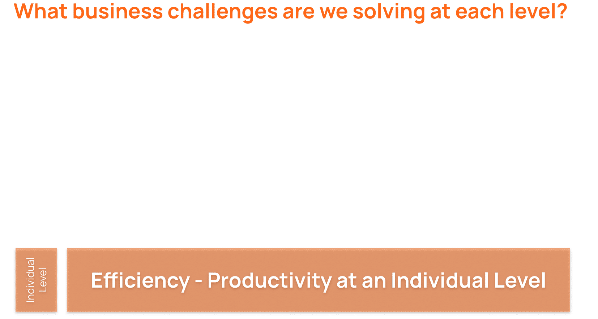
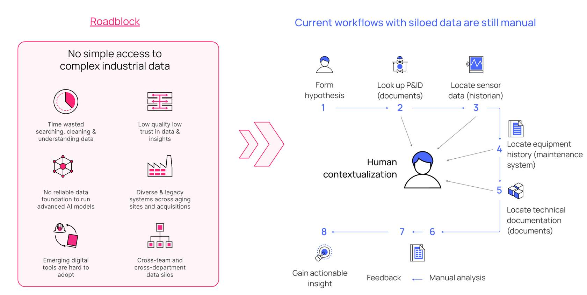
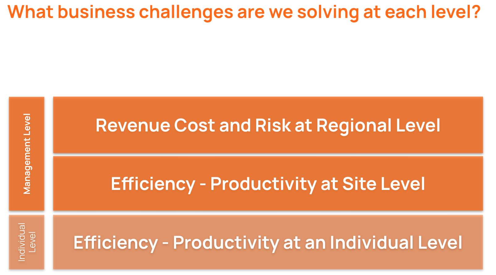
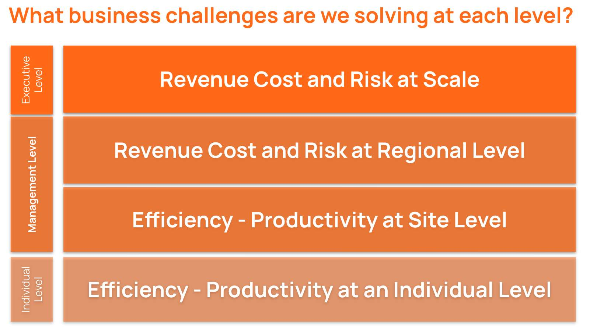

# What problem are we solving at each level

Understanding your customer's challenges and business goals throughout the organization  helps you start building a relationship with customers that differentiates you from other vendors.  Without business pain, there is no business. If your prospects don't have a problem that needs solving, they won't be buying anything. It’s your goal to listen to your prospects, understand their pain and establish a direct correlation between their pain and your product or service solution. By showing your buyers that you understand their pain, they will work harder to understand the solution you’re presenting.

Making your prospect feel understood opens the door to conversations about the organization’s other challenges. It establishes you as a trusted advisor – someone who can be trusted with key information to help solve the company's problems. It also gives you an advocate within the organization who can pave the way to meetings with higher‐level decision makers who have access to discretionary spending. 

Starting with the Individual level, where we described earlier all personas (Operators, Programmer, Project Manager, etc.), the business challenge they are facing is efficiency associated with the ability to quickly access and explore data, build insights and capture information in order to execute different workstreams. So, at this level we are solving the industrial data problem for users (see the picture below).  It impacts the individual performance and the  possibility to optimize the work.  

Next level is at the Site level, where we have Plant Managers, IT Director or Digital Transformation 
Lead that are facing the business challenges associated with a constant need to increase and sustain  
efficiency and productivity of the plant. Their primary work and focus is on enabling better decision 
making and the efficiency of their individual workers, which will directly impact the plant's 
productivity. 

Corporate Leadership roles consisting of individuals like VP of Manufacturing, Head of IT, etc. are facing business challenges related to regional level. They are concerned with Revenue, Cost and Risks associated with multiple plants within the region and how they can transfer the success from one plant to another to ensure the consistent stable growth and profitability. They are also challenged with balancing the demand among their network of plants to make sure the revenue/demand is equally distributed to keep the profitability on the positive level. 

Executive level is usually the one around which the biggest business challenges are attached to and has the access to discretionary funds that they can allocate based on the needs. Their focus is around Revenue, Cost and Risk at the Enterprise level and they are interested in tackling only the biggest challenges that create the most impact on the organization. 

