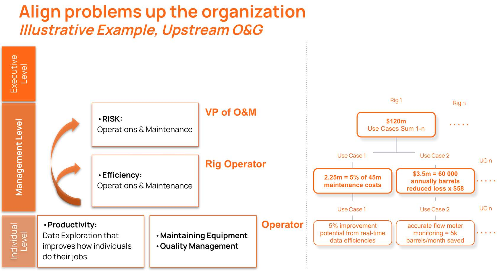

# Example for Energy and Chemical Manufacturing

If we start with our most common challenge, operators spending too much time to find the right information and data to perform their job, we can see how Cognite Data Fusion addressing this challenge impacts the entire organization, from bottom to top. 

Energy
Company A spends $45M a year on maintenance costs. From working with existing customers, it’s common to have operators spend 2+ hours a day looking for the right information before they begin their maintenance tasks.

Click on "Start" button to learn how we enable customer at all levels within the organization and what is the dollar impact

With Cognite Data Fusion we have helped companies reduce the time their maintenance engineers spend looking for the data to perform their job from 2+ hours to 30 minutes. If we are conservative and calculate that Cognite Data Fusion can help companies improve their productivity by 5%, which equates to a savings of $2.3M per year. This is the additional cost savings as we improve the productivity of other workers, such as operators, quality and reliability managers. 

Additionally, the productivity of a Rig Operator is tied to the ability to gain faster relevant insights and make high quality, AI powered business decisions. As we evaluate the impact of each use case through the organization we can identify the aggregated impact in dollar value created by Cognite Data Fusion. One Rig can have up to 120 Million dollars in estimated value gain by implementing our solution through N  number of different use cases that are solving concrete business or operational challenges at the individual and facility level. 

Looking at the Enterprise level, the utilization of Cognite Data Fusion within the Operations & Maintenance business area contributes to the reduction of costs and together with other use cases among N number of facilities belongs to the pool of potential $600 Million value impact aggregated with Cognite throughout the customer’s organization. 

Chemical Manufacturing
Operator, at Company B, spends many hours during the week on field walks and audits, which in addition to time inefficiency, has also health and safety risks. From working with existing customers, it’s common to have operators perform visual inspections or gather data about certain assets or parts of a facility on the field.

Click on "Start" button to learn how we enable customer at all levels within the organization and what is the dollar impact.

With Cognite Data Fusion enabling simple access to the right industrial data our customer has saved 32h per month. In addition to the saved time, implementing an additional Cognite use case has impacted the organization with up to a 10% reduction in the number of bad actors. 

Once we look at the impact, from the plant manager perspective, we can see that it has a dollar value of  $250k saved per year and $300k value saved from reduction in the number of bad actors. 

Moving up the hierarchy within the organization, we can see that the aggregated impact with Cognite Data Fusion on the customer’s business can reach up to $500 Million dollars in value.