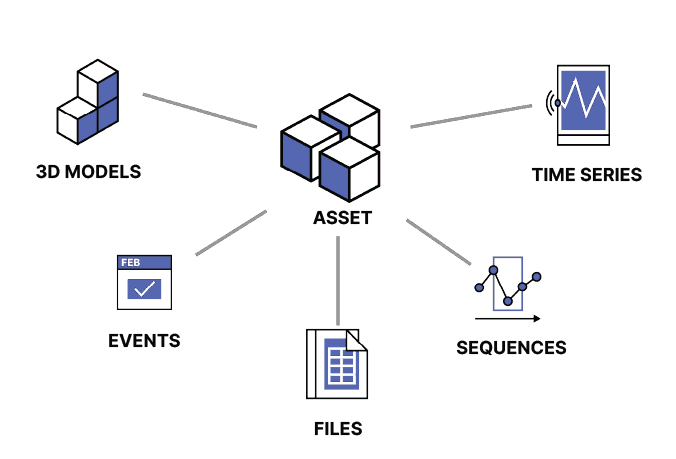
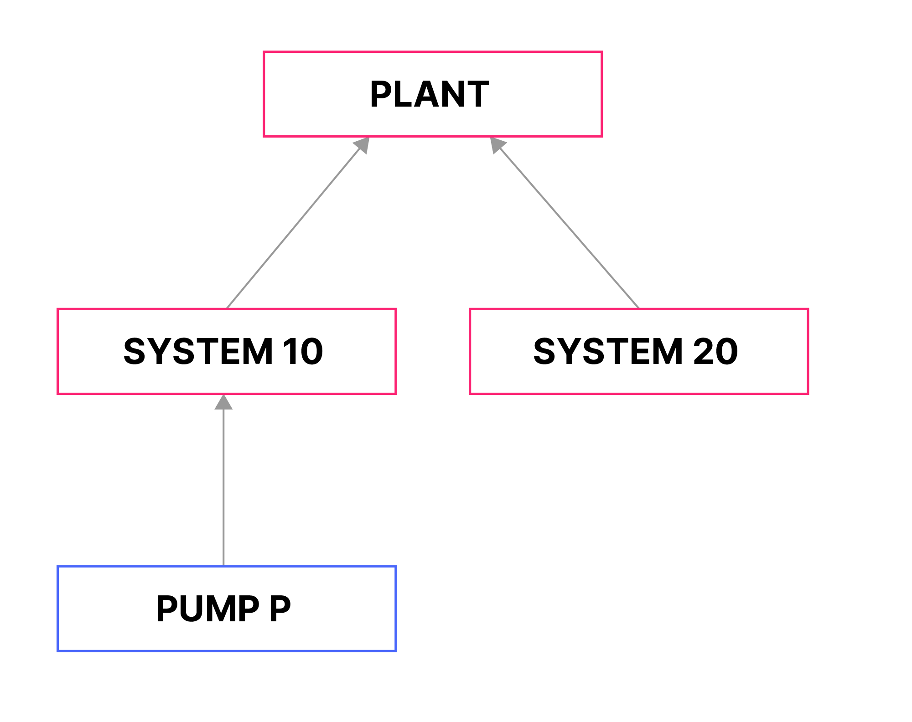
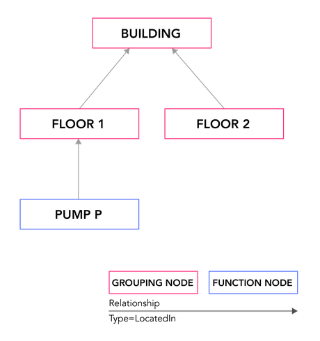

# The CDF data model and resource types

A data model is an abstract model that organizes data elements and standardizes how they related to one another and the properties of real world entities.The CDF data model collects industrial data by resource types that let you define the data elements, specify their attributes, and model the relationships between them. The different resource types are used to both store and organize data.

# Resource types to store data

Most of the resources types in CDF are used to store different types of data. Let's have a closer look at them:

## Assets

We'll start with the assets resrouce type. It stores digital representations of objects or groups of objects from the physical world.

Assets connect related data from different sources and are core to identifying all the relevant data to an object. All other resource types, for examples, time series, events, and files should be connected to at least one asset, and each asset can connect to many resources and resources types.

Assets are typicall organized in hierarchies. For examples, a water pump asset can be part of a sybsytem asset on a plan asset.

## Time series

The time series resource type stores a series of data points in time order. Examples of a time series are the temperature of a water pump asset, and the daily average number of manufacturing defects.

## Events

The events resource type stores information that happens over a period of time. Events have a start time and an end time and can be related to mutiple assets. For example, an event can describe two hours of maintenance on a water pump and associated pipes or a future time period when the pump is scheduled for inspection.

## Files

The files resource types stores documents that contain inforamtion related to one or more assets. For example, a file can contain a piping and instrumentation diagram (P&ID) that shows how mutiple asset are connected.

## 3D models

The 3D models resource type stores files that provide visual and geometrical data and context to assets. For example, we can connect a pump asset with a 3D model of the plant floor where it's located.

## Sequences

The sequences resource type stores series of rows indexed by row number.Each row contains one or more columns with either string or numeric data.Examples of sequences are performance curves and various types of logs, for example, depth logs in drilling.

# Resource types to organize data

A smaller group of resource types lets you organize and define the relationships between the storage resource types:

## Relationships

The Relationships resource type represents connections between resource objects in CDF. Each relationship is between a source and a target object and can be time-constrained with a start and end time.

One way to use relationships is to organize assets in other structures in addition to the standard hierarchical asset structure.

For example, you can choose to organize assets by their physical location or build a graph structure that allows you to navigate assets by mimicking their physical connections through wires or pipes.

## Labels

With labels you can create a predefined set of managed terms that you can use to annotate and group assets. You can organize the labels in a way that makes sense in your business and use the labels to make it easier to find what you want.

For example, you can create a label called pump, apply it to all asset resources that represent pumps, and then filter assets to see only pumps.

## Data sets

A data set is a container for data objects and has metadata with information about the data it contains. Data sets group and track data by its source. For example, you can use the data set metadata to document who is responsible for the data, upload documentation files, describe the data lineage, and so on.

Data sets are an essential part of designing and implementing your data governance policies, and that's the topic for the next unit.