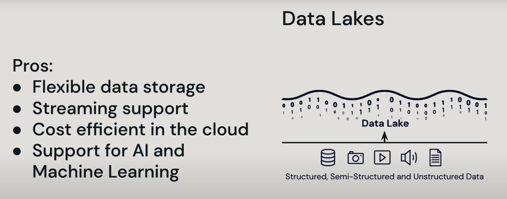
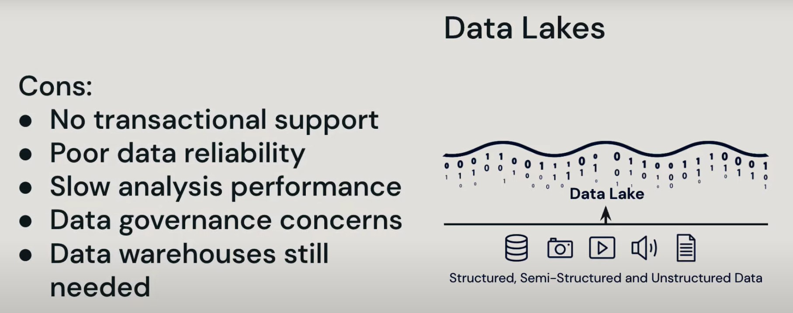
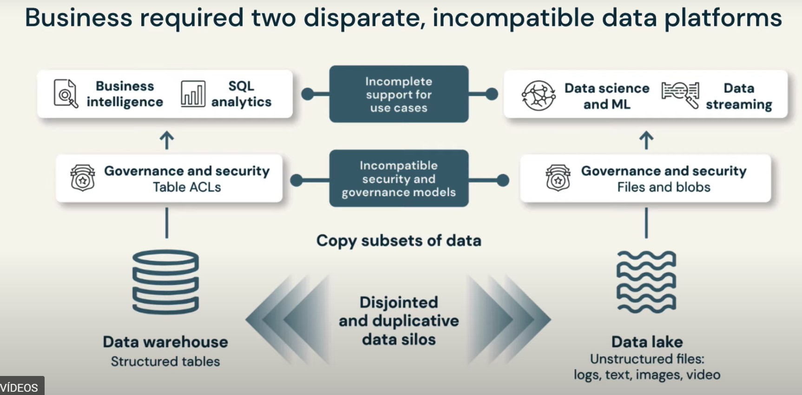
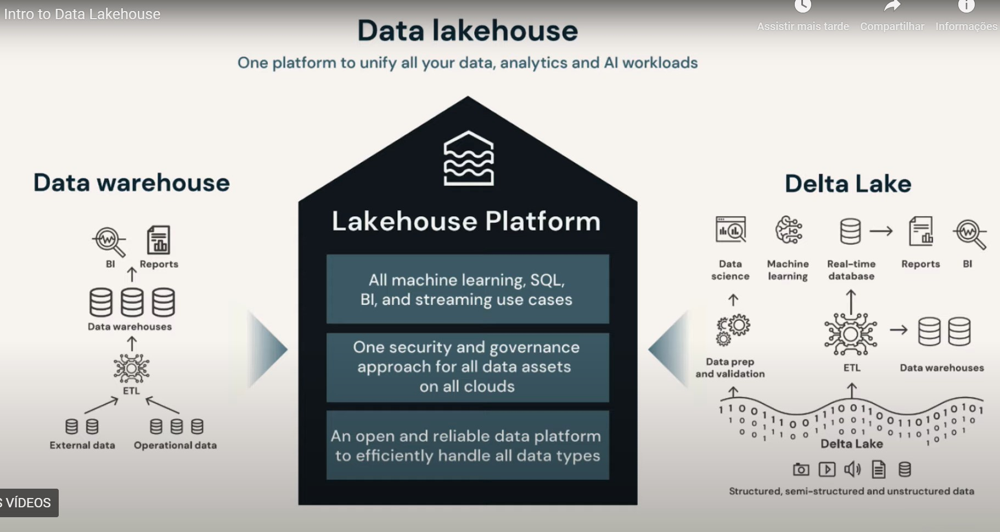
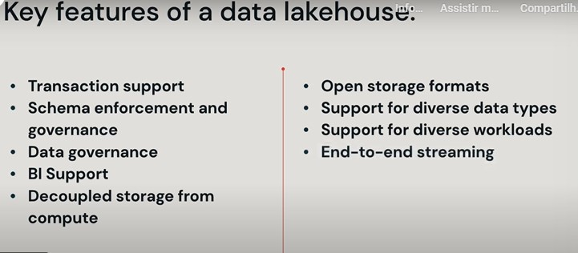

# Introduction to Data lakehouse

In the late 1980s businesses need more than relation database. Businesses wanted to harness data-driven 
insights for businesses deciosion and inovations to do this organizations had to move past simple relational
databases to system that could manage and analyze data that being generated and collected at high volumes 
and at a faster pace.

## Data warehouse

Data warehouses were designed to collect and consolidade this influx of data and provide support for overall
business intelligence and analytics. Data in a data warehouse is structured and clean with predefined schemas
however data warehouses were not designed with semi-structured or unstructured data in mind and became
very expensive when trying to store and analyze any data that didn't fit the schema as companies grew and
the world became more digital data collection drastrically increased in volume, velocity and variety pushing
datawarehouses out of favor it took much time to process data and provide results and there was limited capability to handle data variety and velocity.

Pros:
* Business Intelligence (BI)
* Analytics
* Structured & clean data
* Predefined schemas

Cons:
* No support for semi or unstructured data
* Inflexible schemas
* Struggled with volume and velocity upticks
* Long processing time

## Data Lakes

In the early 2000s the advant of Big Data drove the development of data Lakes where structured
semi-structured and unstrctured data cloud live simultaneously collected in the volumes and speeds necessary. Mutiple data types cloud be stored side by side in a data Lake, data created from many different sources such as web logs or sensor data could be streamed into the data Lake quickly and cheaply in low-cost Cloud object stores however while data Lake solved the storage dillemma it introduced addicional concerns and lacked necessary feature from data warehouses.

First Data Lakes are not supportive of transactional data and can't enforce data quality
so the rekiability of stored in the data lake is 
questionable mostrly due to the various formats.

Second with such a large volume of data the performance of analysis is slower and the timeliness of decision impacting results has nevrs manifesed.

Third governance over the data in a data Lake creates challanges with security and privacy enforcement due to the unstrctured nature 
of the contents of a data Lake.

## Data warehouse & Data lake

Because data Lakes didn't fully replace data warehouses for reliable BI insights, businesses 
implemented complex tecknology stack incluinding data Lakes data warehouses and additional specialized systems for streaming time series graoh and image databases to name a few but such an environment introduced complexity and delyas as data teams were stuck in silios completing disjointed work, data had to be copied between the systems and in some cases copied back impacting  oversight and data usage governance not metion the cost of storing the same information twice with disjointed systems. Successful AI implementation was difficult and actionable outcomes required data from mutiple places.

## Data lakehouse

One platform to unify all your data, analytics and AI workloads.

New data managment architecture was developed as an open architecture combining the benefits of data lake with the analytical power and controls of a data warehouse. Built on a data Lake a data lake house can store all data of any type together becoming a single reliable source of truth providing direct access for AI and BI together

* Transaction Support
    * Including ACID transactions for concurrent read write transactions
* Schema enforcement and governance
    * For data integrity and robust auditing needs
* Data governance
    * To support privacy regulation and data use metrics
* BI Support
    * To reduce the latency between obtaining data and drawing insights
* Decloupled storage from compute
    * Mean each operates on their own clusters allowing them to scale independently to support specific needs 
* Open storage formats
    * Such as Apache parquet wich are open and standardized so a variety of tools and engines can access the data directly and efficiently.
* Support for diverse data types
    *  Business can store, refine, analyze and access  semi-structured, structured and unstructured datain one location
* Support for diverse workloads 
    *  Allowing a range of workloads such as daa science, machine learning and SQL analytics to use the same data repository 
* End-to-end streaming
    *  Removes the needs of system dedicated to real-time data applications. 

## Reference
[Intro to Data Lakehouse, youtube](https://www.youtube.com/watch?v=myLiFw9AUKY)