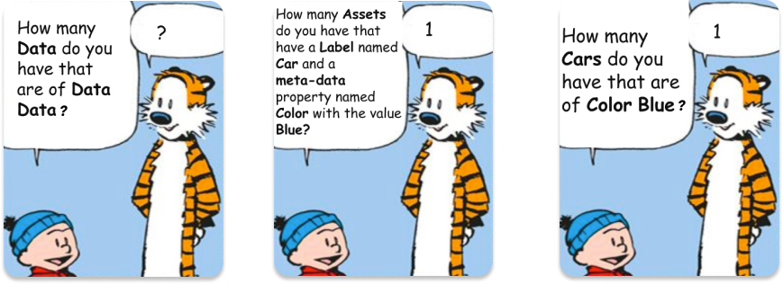
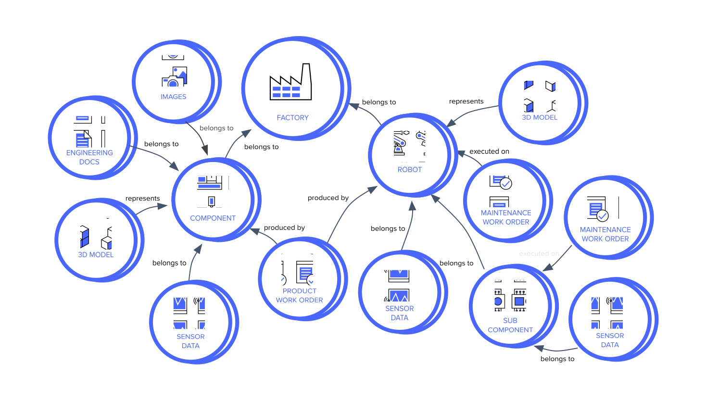

# Data modeling

A data model is a collection of objects types that represent real-word entities and the relantionship with theam.

To help modeling is a good idea to use standards as example for manufacture we can use ISA 95 as name convention.

The following are the data building blocks in Cognite Data Fusion:

Data models: A data model is a collection of entities, their attributes, and relationships. It is used to define the structure of your data and how it is related.

Relationships: Relationships define how entities are connected to each other. For example, a "has" relationship would define that an entity has another entity as a child.

Data types: Data types define the type of data that can be stored in an entity attribute. For example, a "string" data type would indicate that the attribute can store text data.

Instances: Instances are individual representations of entities. For example, a "machine" entity might have many instances, each representing a different machine in your organization.

Spaces: Spaces are logical groupings of data models, relationships, data types, and instances. They can be used to organize your data and make it easier to find and manage.

## the asset hierarchy model

### Property Graph

#### Assets
What are assets? 
Assets are digital representations of objects from the physical world. Assets are typically recognized by humans - i.e. a particular pump, a production system, etc. Assets connect related data from different sources and are core to identifying all the relevant data to an object. All other resource types, for example, time series, events, and files should be connected to at least one asset, and each asset can connect to many resources and resource types.

Why assets? 
We use assets to connect related data from different resources. This makes it easy to find all the relevant data for a particular asset. Assets are at the core of the data model. It enables you to reason over the “things” that exist in your industrial system, how the “things” relate to each other, and to identify all the data related to the "thing".

How?
Assets are organized into asset hierarchies. For example, a water pump asset can be part of a subsystem asset on a plant asset. You can also organize assets into graphs to describe other ways assets are connected or related to each other through relationships. For example, a water pump asset is physically connected to a valve asset describing the full process flow through your system

#### Time series
The time series resource type stores a series of data points in time order. Examples of a time series are the temperature of a water pump asset, the monthly precipitation in a location, and the daily average number of manufacturing defects.

Time series is another Cognite resource type. Each time series can be linked to one asset only. Time series itself contains the metadata, the name, the unit, and other information about the time series. Then we have data points. Each data point contains a timestamp and a value as well as a field that tells us which time series it belongs to.

#### Events
The events resource type stores information that happens over a period of time. Events have a start time and an end time and can be related to multiple assets. For example, an event can describe two hours of maintenance on a water pump and associated pipes or a future time period when the pump is scheduled for inspection.

#### Files
The files resource type stores documents that contain information that is related to one or more assets. For example, a file can contain a piping and instrumentation diagram (P&ID) that shows how multiple assets are connected.

#### Sequences
The sequences resource type stores series of rows indexed by row number. Each row contains one or more columns with either string or numeric data. Examples of sequences are performance curves and various types of logs, for example, depth logs in drilling
 
An asset can have one or more sequences connected to it. You can analyze and visualize sequences to draw inferences from the data, for example to visualize the expected performance of a generator given its load. Another common way to use sequences is to store large amounts of data whose index are not linked to time.

#### 3D Model

The 3D models resource type stores files that provide visual and geometrical data and context to assets. For example, we can connect a pump asset with a 3D model of the plant floor where it's located.

 
Seeing asset data rendered in 3D is a great way to discover and find the data you are interested in. By rendering analysis results in 3D, you can better understand data, for example, by highlighting all equipment that has had issues last year.
 
3D models can be uploaded via the CDF user interface to better visualize and contextualize data.

### Resource type to organize data

A smaller group of resource types lets you organize and define the relationships between the storage resource types. Click the icons to learn more about different resource types to organize data in Cognite Data Fusion.

#### Relationships
The Relationships resource type represents connections between resource objects in Cognite 
Data Fusion (CDF). Each relationship is between a source and a target object and is defined by 
a relationship type and the external IDs and resource types of the source and target objects.

#### Labels
With labels you can create a predefined set of managed terms that you can use to annotate and group assets, files, and relationships. You can organize the labels in a way that makes sense in your business and use the labels to make it easier to find what you want.

For example, you can create a label called pump and apply it to all asset resources that represent pumps, and then filter assets to see only pumps. You can also use labels to define and manage the available types for relationship resources.

 

Typical use cases for labels include:

Categorize assets into equipment types.
Locate assets by equipment type.
Define relationship types.
Assign a document type label to files.

### Data sets
A data set is a container for data objects and has metadata with information about the data it contains. Data sets group and track data by its source. For example, you can use the data set metadata to document who is responsible for the data, upload documentation files, describe the data lineage, and so on.

All data ingested into Cognite Data Fusion should be contained by a data set that describes the origin of the data and additional information. For example, when integrating time series from a historian, all-time series should be placed within a data set where you document the data’s source, who is the contact person, etc.

Data sets are an essential part of designing and implementing your data governance policies. You can organize the following resource types into data sets:

Assets
Events
Files
Time series
Sequences
Relationships

A detailed summary
In this course, you've learned that every interaction concerning data needs a vocabulary (a data model!) in place for it to make sense. Untargeted data models make data consumption cumbersome, as consumers have to adapt to a predefined vocabulary. The ability to create targeted data models for each use case provides a shared vocabulary between data providers and data consumers.

Calling things what they are is what data models should do, allowing for specific and direct queries.

Types, fields, and relationships.
A data model determines the structure of data elements (types) and how they relate to one another and to real-world entities. The data model consists of different object types, which have fields that hold distinct properties of what they represent and their relationship.

Model data according to the domain.

Different perspectives.
In this course, you also learned about the following data model categories:

Source data models represent the data structure in a customer source system. These data models are likely to conform to vendor standards, and their primary purpose is to enable data engineers to validate customer source data stored in CDF. Data engineers typically work with subject matter experts (SMEs) to understand the data models. The SMEs understand the domain well and know how data is modeled in the source systems.

Domain data models enable companies to organize and explore extensive, complex, and heterogeneous data collections. They help solution builders and application developers quickly identify the data they need to create a solution data model without having to know the source system data model.

Solution data models typically represent a subset of data available in a domain data model and only expose the data required by an application or solution. If the data requirements are simple, you can create solution data models directly from source data models without implementing a domain data model.

Stay tuned for updates coming to this course!
In order to build data models that can effectively serve different purposes, the building blocks from which they are created need to be customizable. We'll add more in-depth learning material on the specifics of the CDF data model soon.

