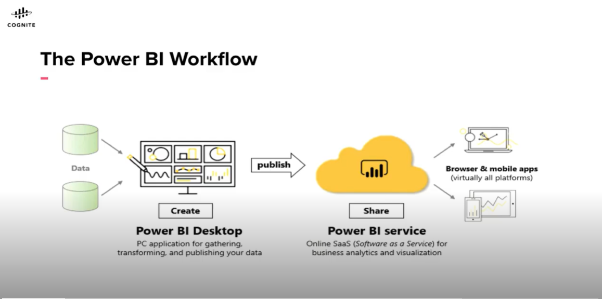
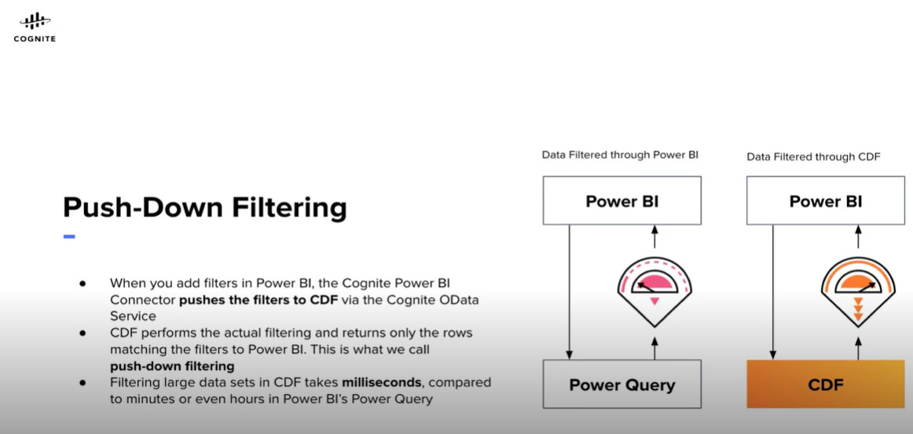

# Introduction to CDF & Power BI

## The Power BI Workflow


When you're working with Power BI, you will typically start by connection to data sources and building a report in the Power BI Desktop.
Then you'll publish that report from there to the Power BI service and then share it so end-users in the Power BI service can view and interect with it. 

## Cognite Power BI Connector

Cognite Power BI Connector enables you to load contextualized CDF data into Power BI.

You will setup the project and API Key to connect to a collaborative project. User will need their own API Key to view the data.

Power BI Desktop available at  
https://www.microsoft.com/en-us/download/details.aspx?id=58494

## Connect to CDF
### Summary
1.  First, make sure that you have installed at least November  2021 or later version of Power BI Desktop. To automatically stay updated with the latest version, download Power BI Desktop from the Microsoft Store.
2.  Once you have successfully installed the application, open Power BI Desktop. 
3.  Click Get Data and then More. Then, in the Get Data dialog box, select Other and the Cognite Data Fusion connector.
4.  Click Connect.
5.  Enter the following project name along with Azure AD tenant ID and click OK: 
``` publicdata?tenantID=48d5043c-cf70-4c49-881c-c638f5796997 ```
6.  In the Authentication dialog, select Organizational account, and then Sign in with your user credentials linked to the Azure AD group. For publicdata, your credentials are the same as you use to sign in to Cognite Hub and Cognite Learn.
7.  Select Connect.
8.  In the Navigator, you should see the tables and data you have access to in CDF.
9.  Select a table, for instance Timeseries, and then select Transform Data.
10. You can now transform the data with the Power Query Editor.

## Filtering

Projects can contain A LOT of data, and downloading it all into Power BI is not very efficient.

### Adding filters in the power query editor

#### Summary
1.  Power Query is a data connection technology that enables you to discover, connect, combine, and refine data sources to meet your analysis needs. We will use Power Query editor to filter down our time series query and run a function to retrieve the data points for the time series we are interested in.

2.  Click the drop-down button at the right of the column header you want to add the filter to. In this example, we use the column Name.

3.  Select Text Filters and then the type of filter you want, for example, begins with.

4.  In the Filter Rows dialog box, select Advanced to define multiple filters at once. 

5.  Let's specify conditions to filter the rows in the column. For the first clause, select Name from the Column dropdown and begins with from the operator dropdown, and type VAL_23 in the value box. Select And from the And/or menu. For the second clause, select description from the Column dropdown and equals from the operator dropdown, and type PH in the value box. This means we are filtering all the time series and only displaying those whose Name begins with VAL_23 and whose description is exactly PH. 

6.  Click Ok.

7.  The Cognite Power BI Connector sends the query to CDF for filtering, and Power 

8.  Query displays the results that are returned from CDF. Note that Power Query displays only a preview of the result set, usually 1000 rows. The final filtering will happen when you click Close and apply.

9.  See the Power Query Quickstart Guide from Microsoft to become more familiar with the Power Query Editor.


### Push-down filtering 

* When you add filters in Power BI, the Cognite Power BI Connector pushes the filter to CDF via the Cognite OData Service
* CDF performans the actual filtering and returns only the rows matching the filters to Power BI. This is what will call push-down filtering
* Filtering large data sets in CDF takes milliseconds, compared to minutes or even hours in POWER BI's Power Query.



### Custom queries

#### Summary
1.  Open Power BI, click Get Data in the Power BI main window, select the Cognite Data Fusion connector and click Connect.
2.  In the project name field, there are three things to add: the project name, the resource, and the filter in the following format: 
``` <project-name>/<resource-type>/?$filter=<Filter> ```
3.  In this example, we use the publicdata project to query from, Assets as the resource type, and we will add some filter expressions to limit the results. You can also create multi-attribute filters by chaining filters with and/or terms.
4.  Let's go ahead and type in the project name, the resource type and the filters along with Azure AD tenant ID and click OK:
``` publicdata/Assets/?$filter=MetaData/RES_ID eq '525283' and Name eq '23-TE-96116-04'&tenantID=48d5043c-cf70-4c49-881c-c638f5796997 ```

5.  This is an example of an AND filter on Metadata and Name. 
6.  And then Transform Data to open a preview of the query.
7.  This data is filtered according to our specifications. Now, we can add more filters if needed. If not, clicking Close & Apply will load the data.
8.  You can see all the data you queried for by clicking the Data view.

