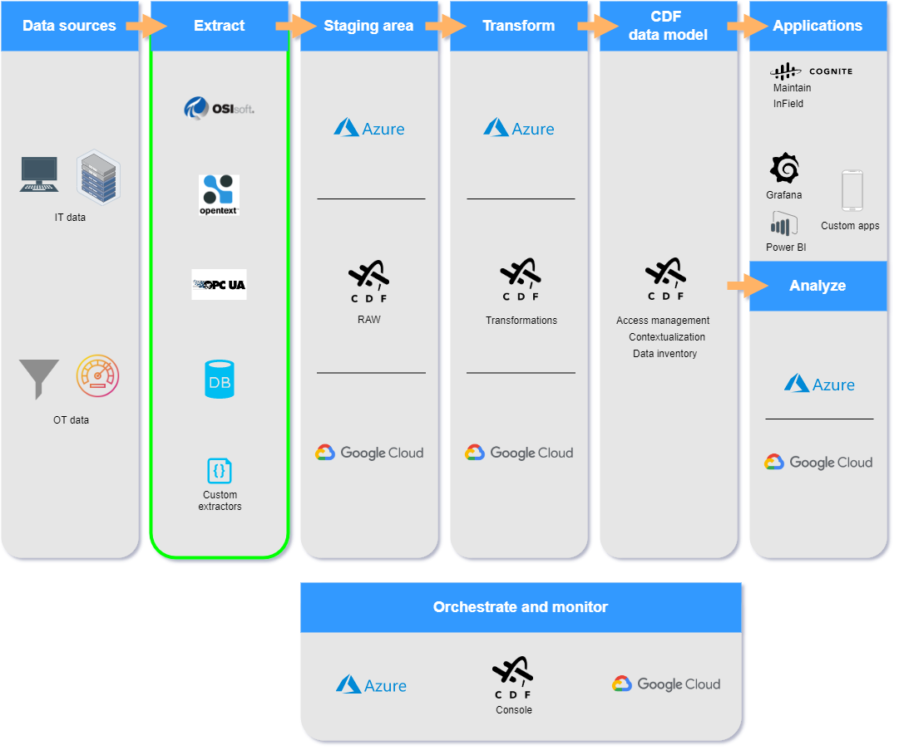

# Integration Fundamentals

## Extractors

### Data extract

* DB Extractor
* Cognite Documentum Extractor
* Cognite OPC-UA Extractor
* Cognite PI Extractor

CDF can extract data in batches to staging area (RAW), also they can extract data directly to the CDF data model with little or no data transformation.

* Cognite DB Extractor 

The DB Extractor can connect to most databases that support SQL, for example Oracle, MySQL or Postgres.
Uses Python SDK. 

The DB extractor uses Open Database Connectivity (ODBC) that is a standard API for accessing different database management systems in a single standardized way. This means that we don't have to write extractors for each existing database. We can just write an extractor for ODBC that provided the translation engine. The DB extractor can connect to most databases that support SQL. For example: Oracle, PostgreSQL or MySQL

* Cognite Documentum Extractor

OpenText Documentum is a document management system that is widely used in the oil & gas industry. The Documentum Extractor supports both "DFC" and "D2" extraction modes. Uses Python SDK.

* Cognite OPC-UA Extractor

OPC-UA is an open protocol that is very popular in the industry and manufacturing segment. Uses .NET.

If you want to read more, please take a look at the [documentation](https://docs.cognite.com/cdf/integration/guides/extraction/opc_ua/).

Cognite PI Extractor
The Cognite PI Extractor extracts data from the OSISoft PI Server and makes time series available in CDF in near real-time. Uses .NET.

If you want to read more, please take a look at the [documentation](https://docs.cognite.com/cdf/integration/guides/extraction/pi/). 

Other ways to integrate with CDF

In some use cases, data engineers and solution architects directly ingest data through APIs without using SDKs. CDF supports REST APIs ( Open API specification) for data ingestion

### Staging area (RAW)

Tabeluar data is stored, if you need reprocess so copy to the raw data and than transform it. the copy in lightway

# Data Transformation

* Reshape
* Enrich
* Contextualize
* Analyze
